### 作者微信：grapro666 QQ：3642795578 (支持部署调试、支持代做毕设和论文)

### 接javaweb、python、小程序、H5、APP、各种管理系统、单片机、嵌入式等开发

### 选题+开题报告+任务书+程序定制+安装调试+论文+答辩ppt

**博客地址：
[https://blog.csdn.net/2303_76227485](https://blog.csdn.net/2303_76227485)**

**视频演示：
[https://space.bilibili.com/384537280](https://space.bilibili.com/384537280)**

**毕业设计所有选题地址：
[https://github.com/codegitpro/allProject](https://github.com/codegitpro/allProject)**

ssm在线测试与论文管理系统

#说明:
前端基于easyui + bootstrap,后端基于ssm+jsp+mysql

#功能简介:

学生：科目测试,查看测试报告,预选老师,论文上传与下载,修改个人信息.

老师：查看学生成绩,管理学生预选,管理课题,分配课题,批改学生论文,修改个人信息.

管理员：老师,学生,院系,专业,课程,课题,题库管理.

基础环境 :IDEA，maven3.6，JDK 1.8 ， Mysql 5.7

#访问地址
http://localhost:8989/pms

管理员 (admin/admin)

学生  001/123

教师  201801/123

#运行截图
学生页面
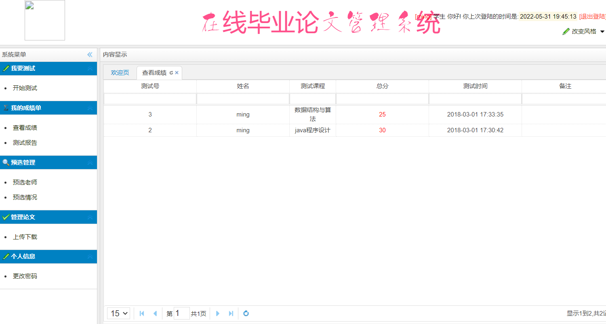

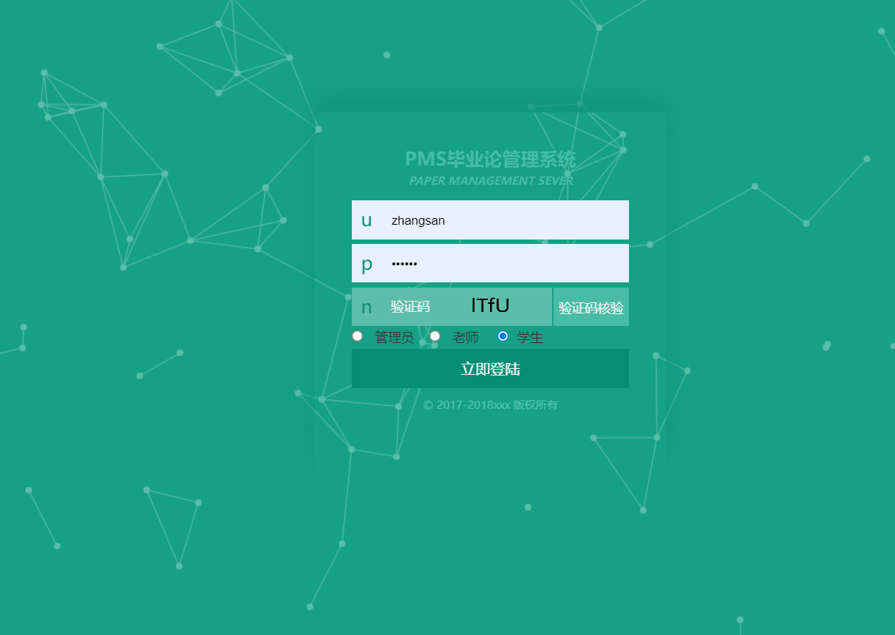

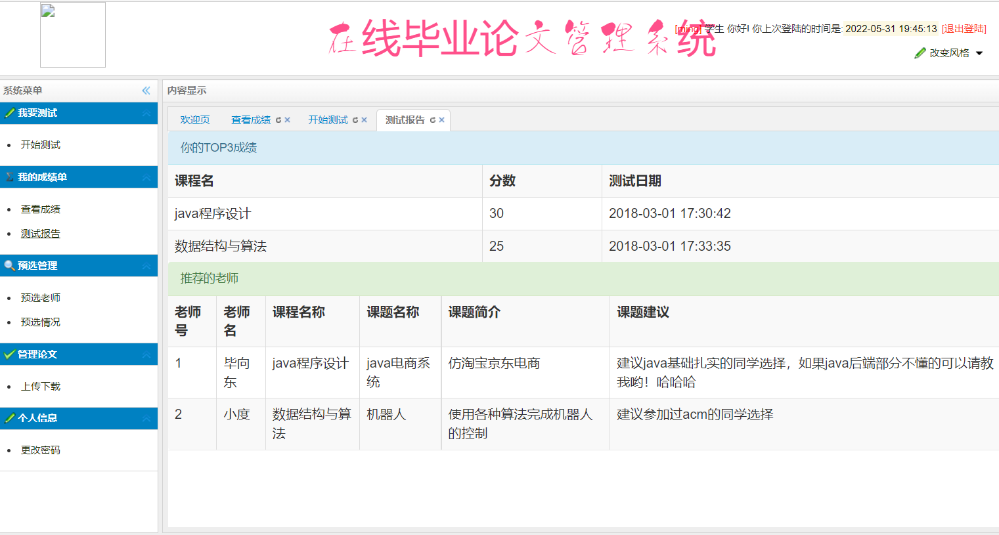

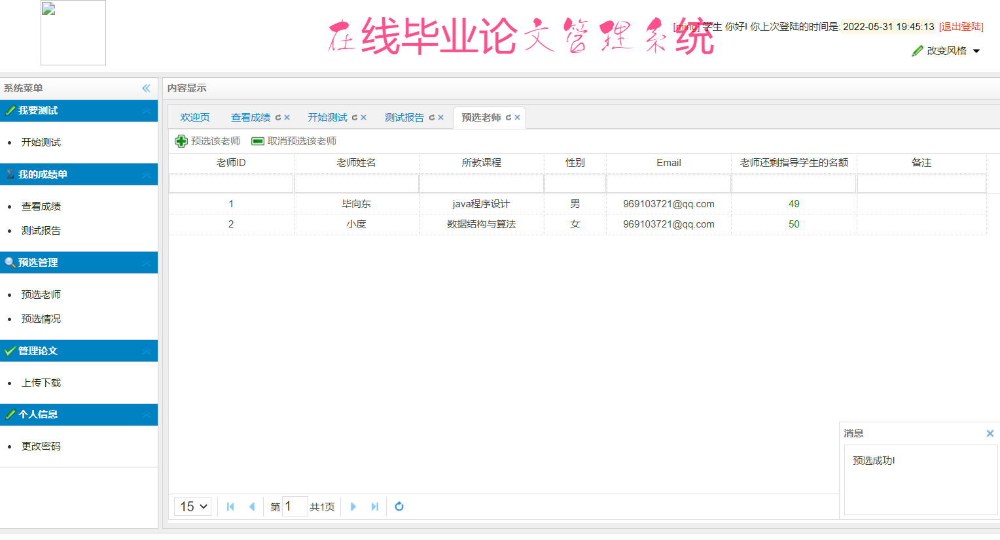

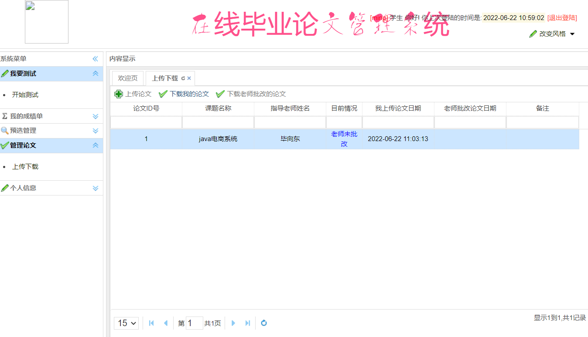

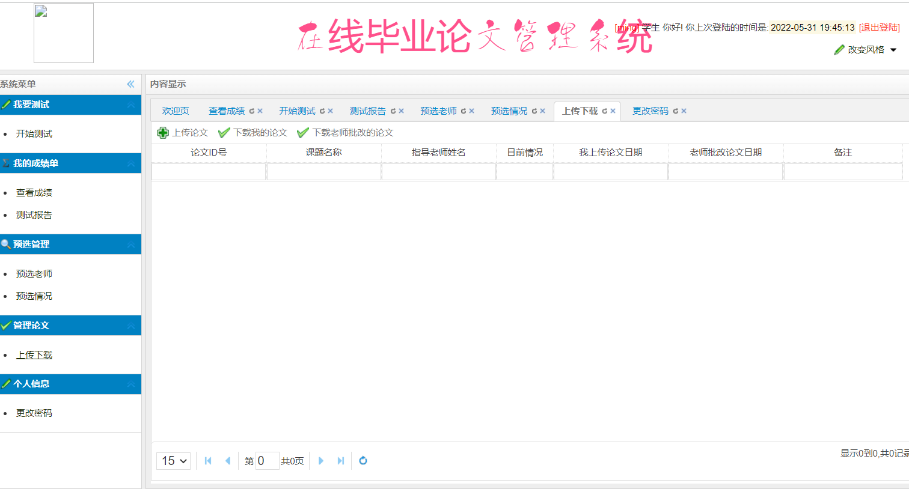

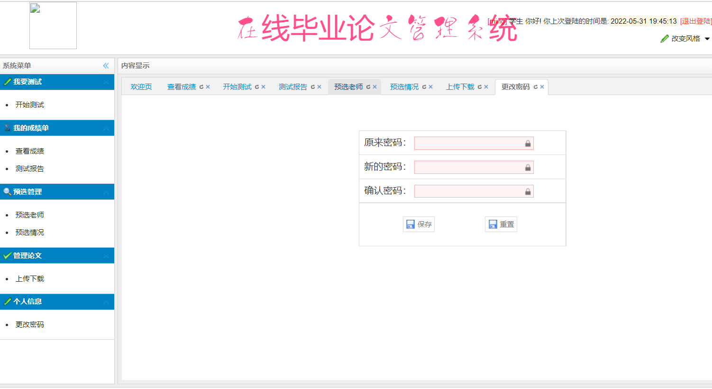

#教师页面

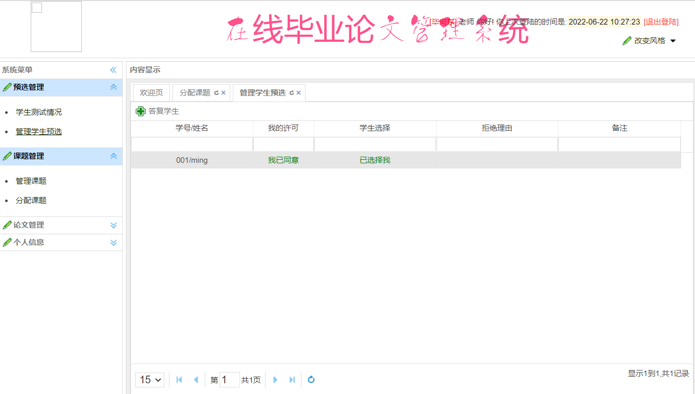

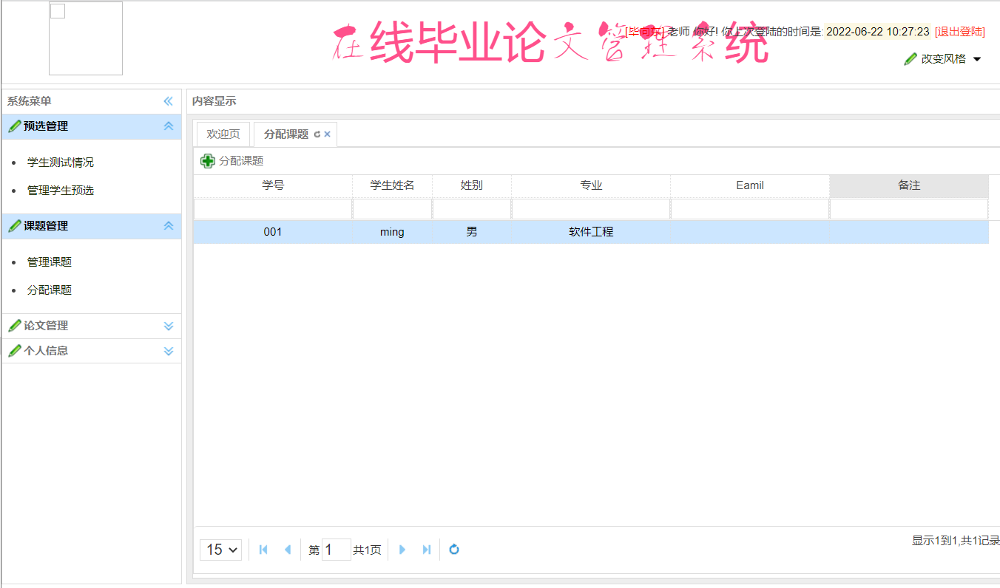

#管理员页面

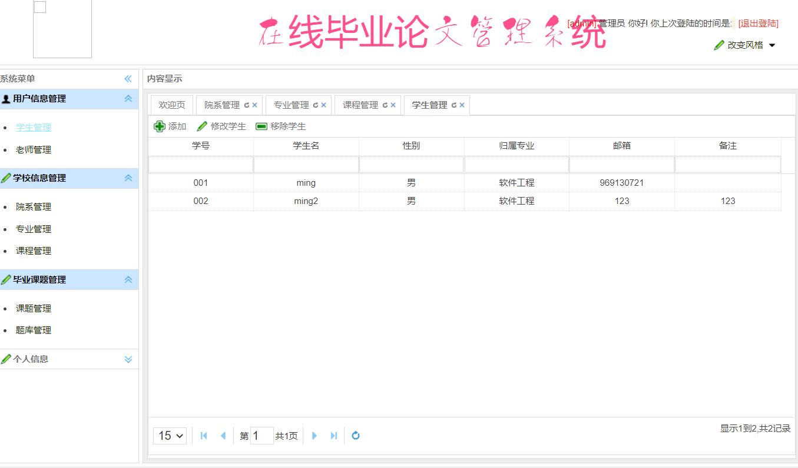

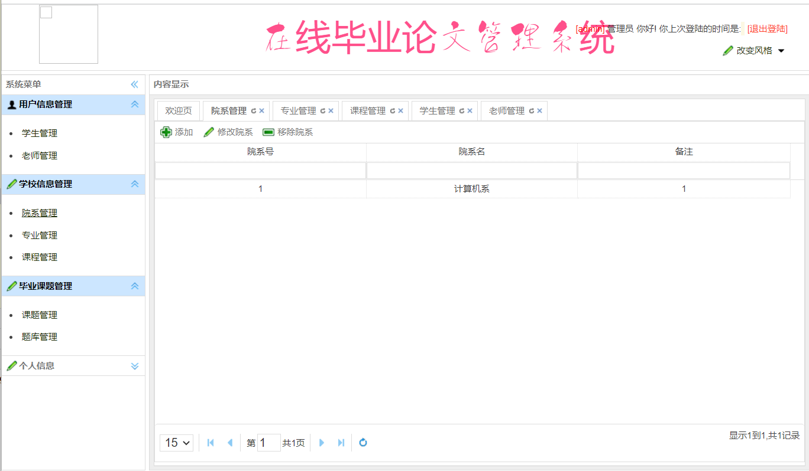

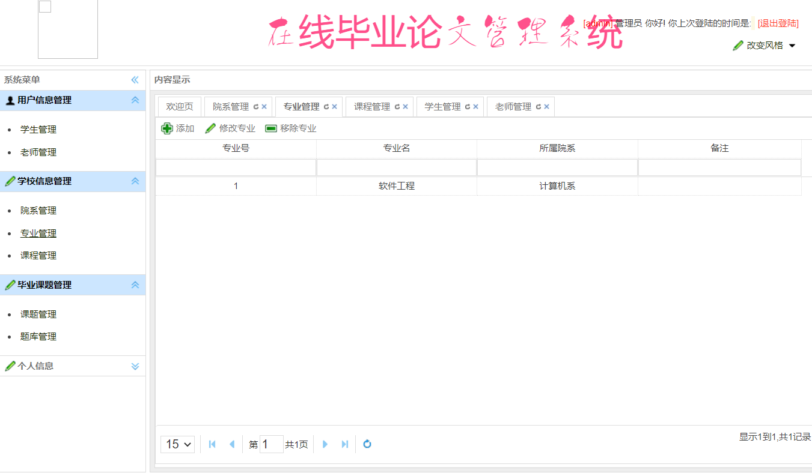

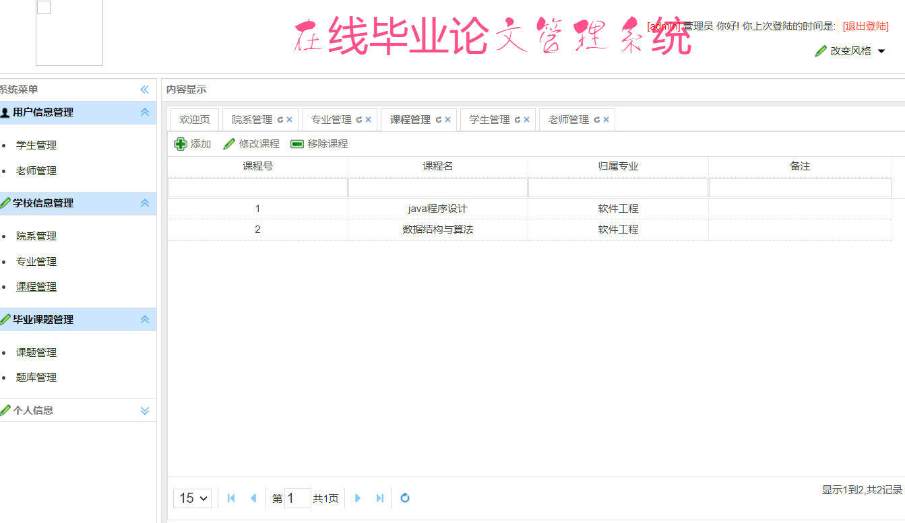

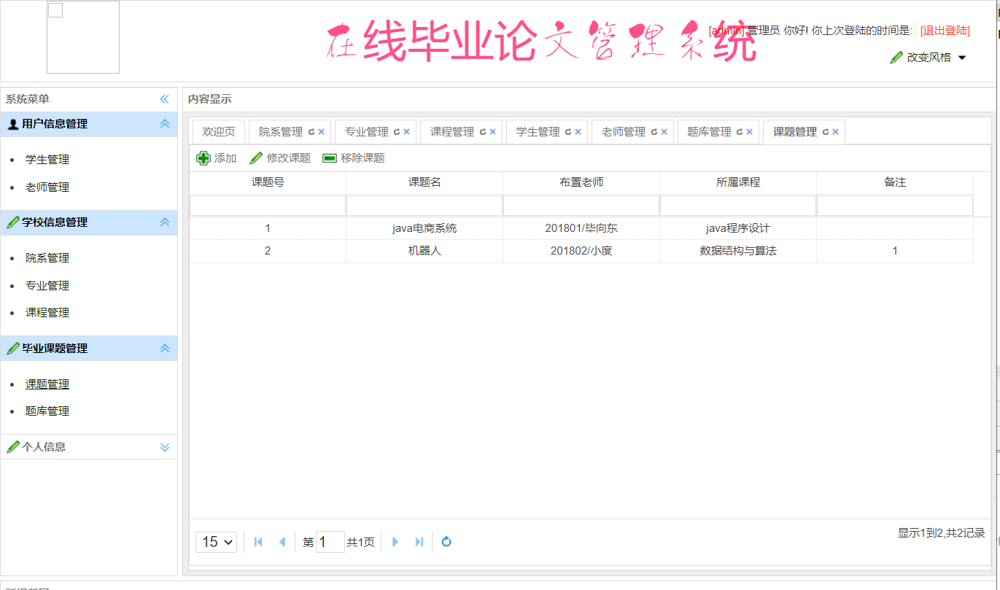

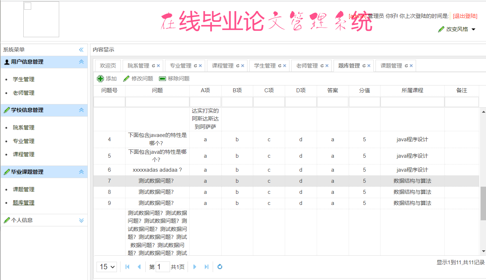
### 源码+数据库脚本 

所有项目以及源代码本人均调试运行无问题 可支持远程调试运行

**需要完整代码可以加qq  931708230 或者加微信 ynwwxid**

**需要完整代码可以加qq  931708230 或者加微信  ynwwxid**
